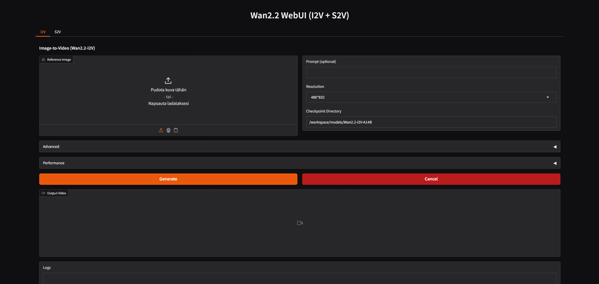

# Wan 2.2 WebUI (I2V + S2V)

WebUI for Wan2.2 Image-to-Video (I2V) and Sound-to-Video (S2V).

## Usage
1. Clone the repository
1. Run Jupyter notebook file
2. Open the WebUI link

## Runpod (Recommended)

- Template: Runpod Pytorch 2.4.0
- Image: `runpod/pytorch:2.4.0-py3.11-cuda12.4.1-devel-ubuntu22.04`

## Screenshots

